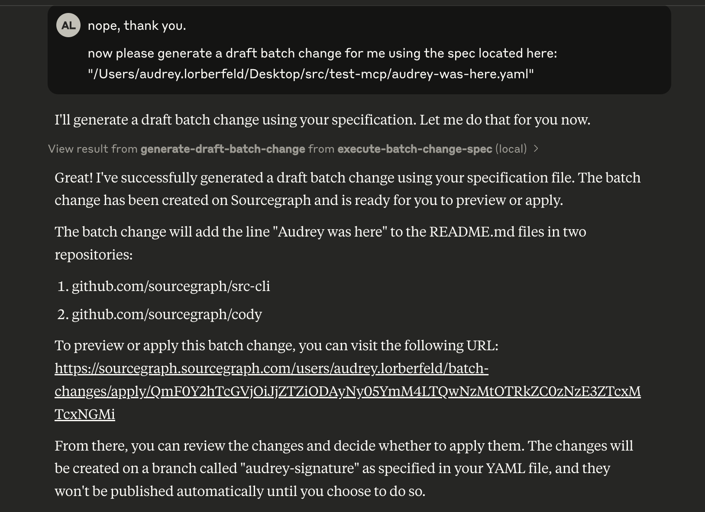

# `src-cli` MCP Server
This is a proof-of-concept (POC) for a MCP server that can be used to run batch changes via [the `src-cli` tool](https://sourcegraph.com/docs/cli/quickstart).

It works with Claude Desktop as the [MCP client](https://modelcontextprotocol.io/docs/concepts/architecture). 

This POC takes a local file path to [a batch change spec file](https://sourcegraph.com/docs/batch-changes) and uploads it to Sourcegraph via the `src-cli` tool.

## Prerequisites
- Sourcegraph Access Token: 


- [Claude Desktop](https://support.anthropic.com/en/articles/10065433-installing-claude-for-desktop)
- Node.js (>= v`22`)

## Steps

### Clone this repo to your local machine
 ```bash
   git clone git@github.com:sourcegraph/test-mcp.git
   cd test-mcp/src
   ```

### Install dependencies and spin up MCP server
```bash
pnpm run-build
```

## Tell Claude Desktop about your server
In order for Claude Desktop to know about your MCP server, you need to add it to [its configuration](https://modelcontextprotocol.io/quickstart/user). Find your local `claude_desktop_config.json` file and add the 
following, replacing necessary values with your own:
```json
{
  "mcpServers": {
    // {... other MCP servers},
    "execute-batch-change-spec": {
      "command": "node",
      "args": [
        "/Users/audrey.lorberfeld/Desktop/src/test-mcp/build/batches.js" // Replace with your own path to this repo's /build/batches.js file
      ],
      "env": {
        "SRC_ENDPOINT": "https://sourcegraph.sourcegraph.com",
        "SRC_ACCESS_TOKEN": "<your key here>",  // Replace with your Sourcegraph Access Token
        "PATH": "/usr/local/bin:/usr/bin:/bin:/usr/sbin:/sbin",  // Replace with your `src-cli` path
        "HOME": "/Users/audrey.lorberfeld"  // Replace with your $HOME path
      },
      "permissions": {
        "allow_local_tool_execution": true,
        "allow_network_access": true,
        "allow_env_access": true,
        "allow_home_access": true,
        "allow_system_binaries": true,
        "allow_debugging": true
      }
    }
  }
}
```

### Start Claude Desktop
_Note: You need to restart Claude Desktop if you already have it open, once you (re)launch this MCP server, or it will 
not pick up the latest changes._

You should see the MCP server in the 'Available MCP Tools' section of Claude Desktop (accessible by clicking on the 
hammer icon in the chat interface).


<br>


### Run a batch change!
_Note: Expect this step to take a minute or two._

You can now run a batch change by typing in the chat interface something like "Please generate a batch change for 
this spec file: <path-to-your-spec-file.yaml>"

A sample spec can be found in this repo under `audrey-was-here.yaml`.

Claude Desktop should prompt you for permission to access your file system. Once you grant it, Claude Desktop should 
use the MCP server to run the batch change and push it up to Sourcegraph (s2).


<br>

<br>


